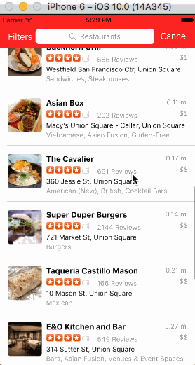

# Project 2 - *Yelp*

**Yelp** is a Yelp search app using the [Yelp API](http://www.yelp.com/developers/documentation/v2/search_api).

Time spent: **20** hours spent in total

## User Stories

The following **required** functionality is completed:

- [x] Search results page
   - [x] Table rows should be dynamic height according to the content height.
   - [x] Custom cells should have the proper Auto Layout constraints.
   - [x] Search bar should be in the navigation bar (doesn't have to expand to show location like the real Yelp app does).
- [x] Filter page. Unfortunately, not all the filters are supported in the Yelp API.
   - [x] The filters you should actually have are: category, sort (best match, distance, highest rated), distance, deals (on/off).
   - [x] The filters table should be organized into sections as in the mock.
   - [x] You can use the default UISwitch for on/off states.
   - [x] Clicking on the "Search" button should dismiss the filters page and trigger the search w/ the new filter settings.
   - [x] Display some of the available Yelp categories (choose any 3-4 that you want).

The following **optional** features are implemented:

- [ ] Search results page
   - [ ] Infinite scroll for restaurant results.
   - [ ] Implement map view of restaurant results.
- [ ] Filter page
   - [ ] Implement a custom switch instead of the default UISwitch.
   - [ ] Distance filter should expand as in the real Yelp app
   - [ ] Categories should show a subset of the full list with a "See All" row to expand. Category list is [here](http://www.yelp.com/developers/documentation/category_list).
- [ ] Implement the restaurant detail page.

The following **additional** features are implemented:

- [x] Have the distance and sort by options as checkmarks instead of switches so that only one could be selected at any time.
- [x] Cosmetic changes to the navigation bar to have it more like the Yelp app.

Please list two areas of the assignment you'd like to **discuss further with your peers** during the next class (examples include better ways to implement something, how to extend your app in certain ways, etc):

1. Have better ways of building the table structure for dynamic table views for settings. UI conventions for iOS and how to implement them.
2. Best practices for storing and reusing information between view controllers. When should we be using the model? When should we be storing data in the view controller? When is the best time to write to the model?

## Video Walkthrough

Here's a walkthrough of implemented user stories:

GIF created with [LiceCap](http://www.cockos.com/licecap/).

## Notes

Describe any challenges encountered while building the app.

I had a lot of trouble trying to build the filters page. At first I thought we were supposed to build it statically, and then I discovered we needed to build dynamically. There weren't many guides to help with dynamic table views and I ended up rebuilding this view three or four times. I would say most of the time spent on this assignment was just understanding what I needed to do for the filters page.

## License

    Copyright [2016] [Iria Tam]

    Licensed under the Apache License, Version 2.0 (the "License");
    you may not use this file except in compliance with the License.
    You may obtain a copy of the License at

        http://www.apache.org/licenses/LICENSE-2.0

    Unless required by applicable law or agreed to in writing, software
    distributed under the License is distributed on an "AS IS" BASIS,
    WITHOUT WARRANTIES OR CONDITIONS OF ANY KIND, either express or implied.
    See the License for the specific language governing permissions and
    limitations under the License.
